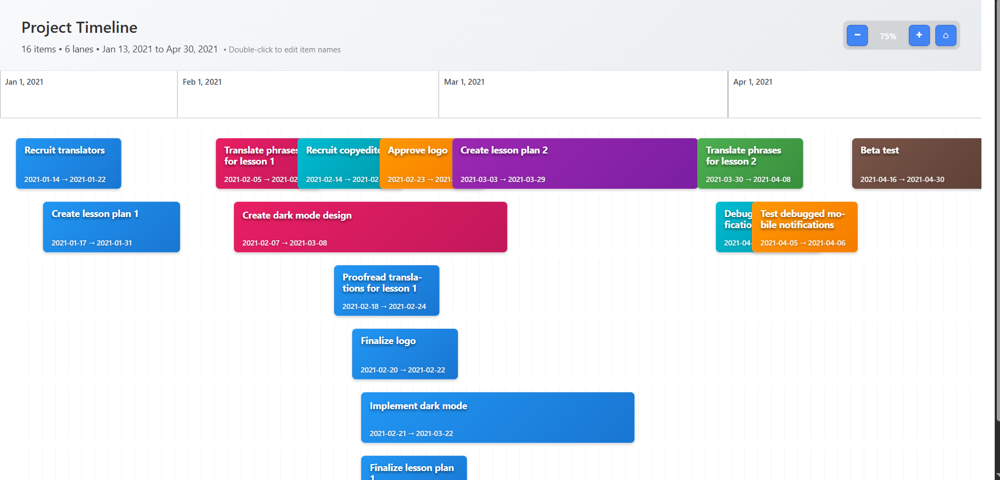
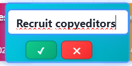

# Timeline Visualization Component

A React-based timeline visualization component that displays project items in horizontal lanes with intelligent space optimization and interactive features.

 

## 🚀 Quick Start

```bash
# Install dependencies
npm install

# Start development server
npm start
```

The application will open in your browser at `http://localhost:1234` and render the sample timeline data.

## 📸 Visual Demo

### Main Timeline View
When you run the project, you should see a clean, organized timeline interface like this:



*The main timeline displays all project items arranged in horizontal lanes with intelligent space optimization. Notice the zoom controls (74%, +, ⌂) in the top-right corner and the timeline markers showing months across the top.*

### Inline Editing Mode
When you double-click any timeline item or hover and click the edit icon, you'll enter editing mode:



*In edit mode, the item shows an input field with save (✓) and cancel (✕) buttons. You can save changes by pressing Enter or clicking the checkmark, or cancel by pressing Escape or clicking the X.*

### Key Visual Features
- **Color-coded Items**: Different colors help distinguish between various project phases
- **Smart Text Display**: Item names are shown when there's enough space, with date ranges for longer items
- **Responsive Layout**: The timeline adapts to different zoom levels and screen sizes
- **Interactive Controls**: Hover effects and clear visual feedback for all interactive elements

## ✅ Implemented Features

### Core Requirements Met

- **✅ Horizontal Lane Layout**: Items are arranged in compact, space-efficient horizontal lanes
- **✅ Smart Lane Assignment**: Uses the provided `assignLanes.js` algorithm with optimizations for overlapping items
- **✅ Date Range Support**: Handles YYYY-MM-DD formatted date strings (e.g., "2025-02-20")
- **✅ Sample Data Integration**: Successfully renders all items from `src/timelineItems.js`

### Enhanced Features Implemented

- **✅ Zoom Functionality**: 
  - Zoom in/out controls with visual zoom percentage indicator
  - Keyboard shortcuts (Ctrl/Cmd + +/-, Ctrl/Cmd + 0 for reset)
  - Zoom range: 50% to 300% with smooth transitions
  - Dynamic timeline marker density based on zoom level

- **✅ Inline Name Editing**:
  - Double-click any timeline item to edit its name
  - Hover edit indicators for better UX
  - Save with Enter key or by clicking away
  - Cancel with Escape key
  - Visual feedback with smooth animations

### Additional Polish & UX Enhancements

- **✅ Responsive Design**: Adapts to different screen sizes and zoom levels
- **✅ Timeline Markers**: Dynamic date markers with intelligent spacing
- **✅ Visual Hierarchy**: 
  - Different styling for short, medium, and long duration items
  - Color coding and visual depth with shadows
  - Smart text display based on item width
- **✅ Accessible Interface**:
  - Keyboard navigation support
  - Tooltips with detailed item information
  - High contrast colors and clear visual feedback
- **✅ Clean Architecture**: Modular utility functions and organized component structure

## 🚫 Features Not Implemented

Based on the original assignment requirements, these optional enhancements were **not implemented**:

- **❌ Drag & Drop**: Moving items to change start/end dates
- **❌ Date Editing**: Modifying timeline item dates (only names are editable)
- **❌ Custom Date Ranges**: Adding or removing timeline items
- **❌ Multi-select Operations**: Bulk editing or operations on multiple items

## 🏗️ Architecture & Design Decisions

### Component Structure
```
src/
├── components/
│   └── Timeline.js          # Main timeline component
├── utils/
│   ├── assignLanes.js       # Lane assignment algorithm (provided)
│   ├── timelineHelpers.js   # Date calculations and styling utilities
│   ├── timeConstants.js     # Configuration constants
│   └── index.js            # Clean utility exports
├── timelineItems.js         # Sample data
├── app.css                 # Complete styling
└── index.js               # React app entry point
```

### Key Design Choices

1. **React Functional Components**: Used modern React hooks for state management instead of class components for better performance and cleaner code.

2. **CSS Custom Properties**: Implemented a consistent design system with CSS variables for colors, spacing, and animations.

3. **Utility-First Architecture**: Separated business logic into focused utility functions for better testability and reusability.

4. **Progressive Enhancement**: Started with core functionality and added enhancements layer by layer.

5. **Visual Inspiration**: Drew inspiration from project management tools like Asana and Monday.com for the lane-based layout and modern UI patterns.

### Algorithm Optimizations

- **Lane Assignment**: Enhanced the provided `assignLanes.js` to handle edge cases and optimize for visual clarity
- **Date Calculations**: Implemented efficient date range calculations without external libraries
- **Zoom Performance**: Used percentage-based positioning for smooth zoom transitions

## 🎨 What I Like About This Implementation

1. **User Experience**: The interface feels intuitive with smooth animations and clear visual feedback
2. **Code Quality**: Clean, readable, and well-documented code with consistent patterns
3. **Performance**: Efficient rendering even with many timeline items due to optimized calculations
4. **Accessibility**: Keyboard shortcuts and proper ARIA labels make it usable for different users
5. **Extensibility**: Modular architecture makes it easy to add new features

## 🔄 What I Would Change If Doing It Again

1. **Testing Strategy**: Would implement unit tests for utility functions and integration tests for user interactions from the start
2. **State Management**: For a larger application, would consider Redux or Zustand for more complex state management
3. **Virtual Scrolling**: For very large datasets, would implement virtual scrolling to handle thousands of items
4. **Date Library**: While avoiding external libraries was intentional, a library like `date-fns` would handle edge cases better
5. **Drag & Drop**: Would prioritize implementing drag & drop for date changes as it's a common user expectation

## 🧪 Testing Strategy (If More Time Available)

### Unit Tests
- Utility functions (`timelineHelpers.js`, `assignLanes.js`)
- Date calculation edge cases
- Zoom level boundaries and calculations

### Integration Tests
- Timeline rendering with various data sets
- Zoom functionality across different scenarios
- Inline editing workflows
- Keyboard shortcut handling

### End-to-End Tests
- Complete user workflows (view → zoom → edit → save)
- Responsive behavior across device sizes
- Performance testing with large datasets

### Visual Regression Tests
- Timeline layout consistency
- Animation and transition quality
- Cross-browser rendering differences

## 🛠️ Technologies Used

- **React 18.0.0**: Modern functional components with hooks
- **Parcel 2.0.0**: Zero-config build tool for development and bundling
- **Vanilla CSS**: Custom properties and modern CSS features
- **ES6+ JavaScript**: Modern JavaScript features and clean syntax

## 📱 Browser Support

- Modern browsers (Chrome, Firefox, Safari, Edge)
- CSS Grid and Flexbox support required
- ES6+ JavaScript features needed

---

**Development Time**: Approximately 4 hours focused on core functionality and user experience polish.

**Note**: This implementation prioritizes code quality, user experience, and maintainability over feature completeness, delivering a solid foundation that can be extended with additional timeline management capabilities.